<div align="center">

<h1>SatQuery AI</h1>

<a href="https://git.io/typing-svg">
  
</a>

<br/><br/>


<br/>


<br/>

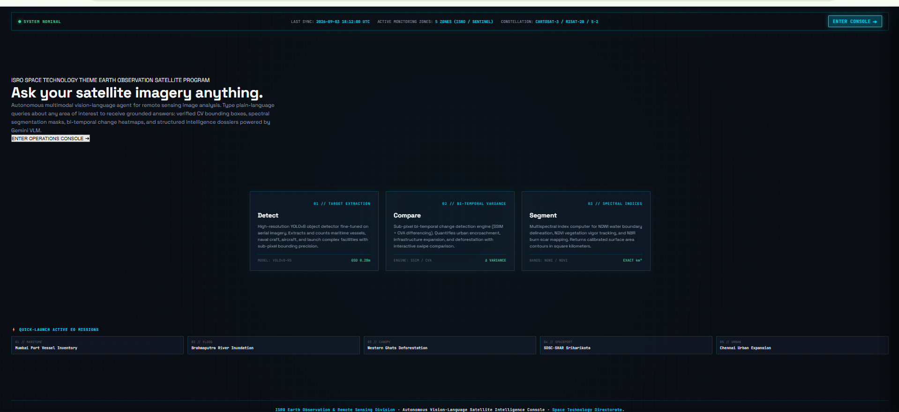

</div>

---

## 📖 Contents

[Why SatQuery](#-why-satquery) · [How It Works](#-how-it-works) · [Capabilities](#-capabilities) · [Interface Tour](#-interface-tour) · [A Mission, Start to Finish](#-a-mission-start-to-finish) · [Trust & Explainability](#-trust--explainability) · [Architecture](#-architecture) · [How It Compares](#-how-it-compares) · [Tech Stack](#-tech-stack) · [Getting Started](#-getting-started) · [Limitations](#-honest-limitations) · [Roadmap](#-roadmap)

---

## 🌍 Why SatQuery

Satellite imagery holds answers to urgent questions: *Where did the flood spread? How much forest was lost? How many vessels are in this port?* But getting those answers normally means picking tools, preparing rasters, writing scripts and interpreting the output by hand.

**SatQuery AI replaces that workflow with a conversation.**

| Traditional workflow | SatQuery AI |
|---|---|
| Data → pick tools → manual GIS analysis → human interpretation | **Question → AI agent → specialist models → multi-sensor evidence → actionable answer** |
| Needs GIS / remote-sensing expertise | Plain-language questions, voice input included |
| Results are maps and numbers you must explain yourself | Grounded answers with regions, metrics, confidence and stated uncertainty |
| One tool per task | An agent that routes each question to the right specialist |

---

## ⚙️ How It Works

<div align="center">
  
</div>

<br/>

You type a question such as *"What changed between these two dates, and where? Quantify area variance."* The agent then:

1. **Understands** the query and identifies the task (detection, change analysis, segmentation, fusion, captioning).
2. **Validates** the imagery: file format, radiometric bands, spatial resolution (GSD), georeferencing / CRS and acquisition dates.
3. **Plans** an execution graph and calls the specialist tools it needs.
4. **Fuses & verifies** evidence across time and sensors, and scores its confidence.
5. **Delivers** a structured intelligence card, map overlays and an exportable dossier.

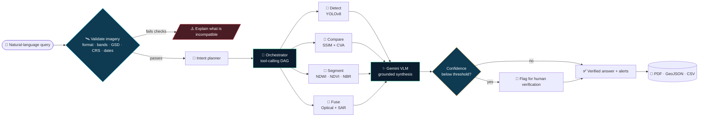

<details>
<summary><b>🎬 Watch a request move through the system (sequence diagram)</b></summary>

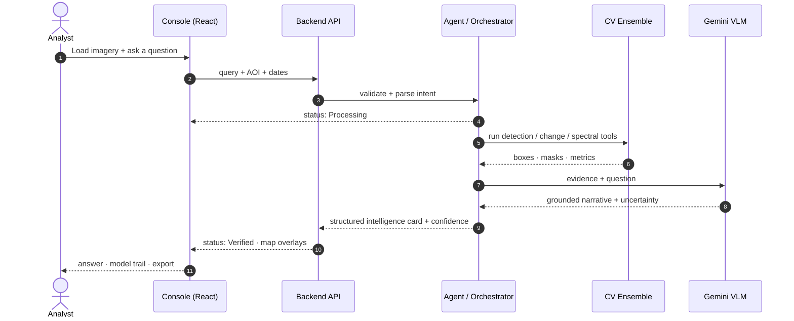

</details>

---

## 🎯 Capabilities

<div align="center">

| 🎯 **Detect** | 🔄 **Compare** | 🌿 **Segment** | 📡 **Fuse** |
|:---:|:---:|:---:|:---:|
| High-resolution **YOLOv8** object detection tuned for aerial imagery | Sub-pixel **bi-temporal change detection** (SSIM + CVA differencing) | Multispectral indices: **NDWI**, **NDVI**, **NBR** | **Optical + SAR** fusion when one sensor is not enough |
| Vessels, naval craft, aircraft, launch complexes | Urban encroachment, infrastructure growth, deforestation | Water boundaries, vegetation vigor, burn scars | Cloud-cover fallback, complementary evidence |
| Bounding boxes, geo-referenced | Interactive swipe / split compare | Calibrated area in **km²** | Cross-modal analysis |

</div>

**Also included**

- 🗣️ **Voice queries** and **Read Aloud** for answers
- 🖼️ **Describe scene**: detailed captioning of land use, terrain and infrastructure
- 🎛️ **Sensor composites**: RGB true colour, NIR false colour, NDWI water, NDVI vegetation, SAR radar, thermal
- 🗺️ **Map layers**: optical, SAR, fused, detections, masks, split compare, reticle and radar view
- 🔔 **Proactive monitoring alerts** for surges and anomalies in watched zones
- 🧾 **Audit log** and role-based access (Analyst · Decision maker · Admin)

---

## 🖥️ Interface Tour

<div align="center">

### Mission console
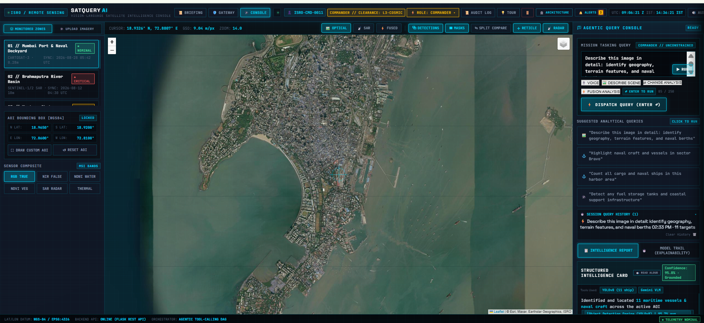

<sub>Monitored zones on the left, live map in the centre, the agentic query console with suggested analytical queries and session history on the right.</sub>

<br/><br/>

### Bring your own imagery
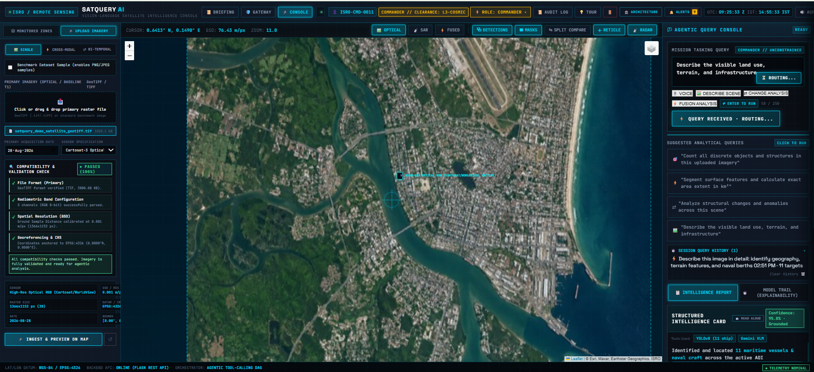

<sub>Drop in a GeoTIFF. A compatibility check verifies file format, radiometric bands, spatial resolution and georeferencing before any analysis runs.</sub>

<br/><br/>

| Query routing | Structured intelligence card |
|:---:|:---:|
| 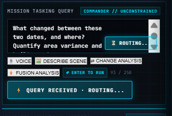 | 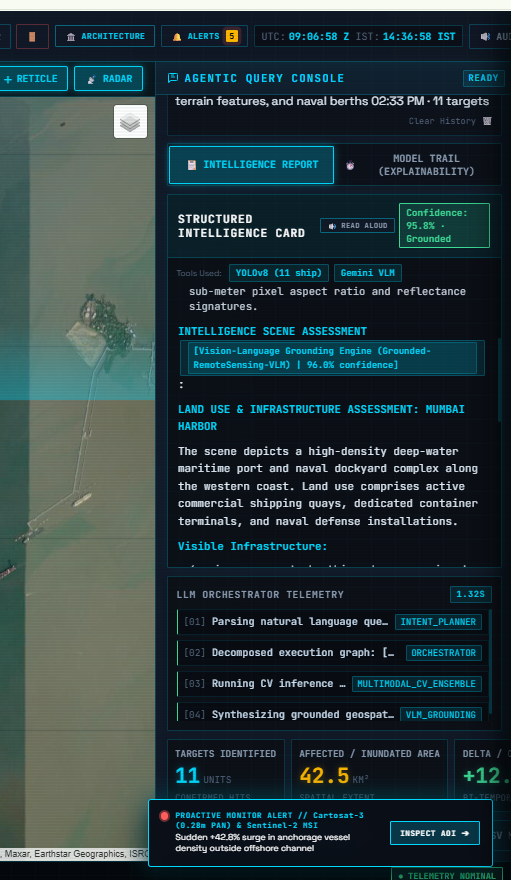 |
| The agent acknowledges the query and routes it to the right tools | Answer, tools used, confidence, model trail and orchestrator telemetry |

<br/>

### Intelligence dossier
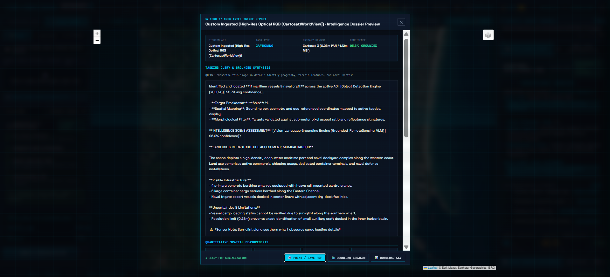

<sub>A full report: mission area, task type, primary sensor, confidence, grounded synthesis, stated uncertainties and quantitative spatial measurements. Export as PDF, GeoJSON or CSV.</sub>

</div>

---

## 🚀 A Mission, Start to Finish

**Example: Mumbai port vessel inventory**

| Step | What happens |
|---|---|
| 1. Pick a zone | Choose a monitored zone (or draw a custom AOI) and a sensor composite |
| 2. Ask | *"Describe this image in detail: identify geography, terrain features, and naval berths"* |
| 3. Route | The agent plans the run: intent planner → orchestrator → multimodal CV ensemble → VLM grounding |
| 4. Detect | YOLOv8 locates **11 vessels**; the VLM assesses land use and port infrastructure |
| 5. Explain | The card lists visible infrastructure **and what it could not determine** (for example cargo status hidden by sun-glint, or small craft below the resolution limit) |
| 6. Export | Download the dossier as PDF, or the detections as GeoJSON / CSV for GIS tools |

**Quick-launch missions built in:** Mumbai port vessel inventory · Brahmaputra river inundation · Western Ghats deforestation · Sriharikota spaceport · Chennai urban expansion.

---

## 🔍 Trust & Explainability

SatQuery AI is built so that an answer can be checked, not just believed.

| Feature | What it gives you |
|---|---|
| **Evidence-grounded answers** | Every claim is tied to detections, masks, metrics or source imagery |
| **Confidence score** | Shown on each intelligence card, with a *Grounded* flag |
| **Uncertainties & limitations** | The report states what could not be verified and why |
| **Tools used** | Each answer lists the models that produced it (for example YOLOv8, Gemini VLM) |
| **Model trail** | Step-by-step explainability view of how the answer was built |
| **Orchestrator telemetry** | Timed steps for parsing, planning, CV inference and grounding |
| **Human verification flag** | Low-confidence results are routed for review instead of auto-approved |
| **Audit log** | Actions are recorded for accountability |

> The confidence value is the system's own estimate. It is a guide for prioritising human review, not a calibrated statistical guarantee.

---

## 🏗️ Architecture

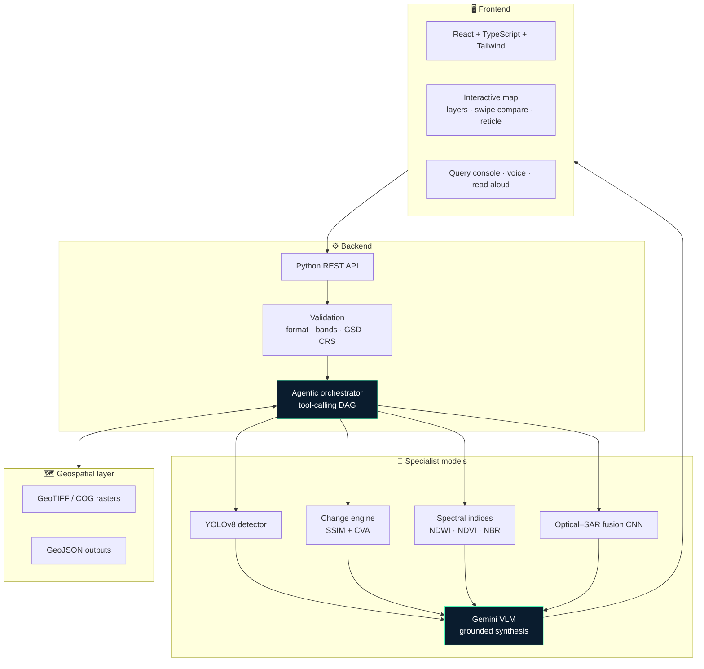

**Design principle:** no single generic model does everything. A lightweight agent decides *which specialist to call*, and the VLM turns their evidence into a readable, grounded answer. Specialists can be upgraded or swapped independently.

---

## ⚖️ How It Compares

| | Desktop GIS | Code-based EO platforms | Imagery viewers | **SatQuery AI** |
|---|:---:|:---:|:---:|:---:|
| Ask in plain language | ✖ | ✖ | ✖ | ✔ |
| Agent picks the right model / tool | ✖ | ✖ | ✖ | ✔ |
| Detection + change + segmentation + fusion in one place | manual | scripted | limited | ✔ |
| Confidence and uncertainty on every answer | ✖ | ✖ | ✖ | ✔ |
| Explainable model trail | ✖ | ✖ | ✖ | ✔ |
| Exportable dossier (PDF / GeoJSON / CSV) | manual | scripted | limited | ✔ |
| Needs GIS / coding skill | high | high | low | **low** |

<sub>Comparison is by category of tool, not a benchmark of specific products.</sub>

---

## 🧰 Tech Stack

| Layer | Technology |
|---|---|
| Frontend | React, TypeScript, Tailwind CSS, Leaflet map |
| Backend | Python REST API with an agentic tool-calling orchestrator |
| Vision-language | Gemini VLM (grounded synthesis and agent reasoning) |
| Detection | YOLOv8, fine-tuned for aerial / remote-sensing imagery |
| Remote-sensing VQA | GeoChat / RemoteCLIP-family models |
| Change analysis | SSIM + CVA differencing |
| Spectral analysis | NDWI, NDVI, NBR indices |
| Fusion | Optical–SAR fusion CNN |
| Geospatial | GeoTIFF / COG rasters, GeoJSON output, WGS-84 / EPSG:4326 |
| Sensors shown | Cartosat-3, RISAT-2B, Sentinel-1/2 |

---

## 🚀 Getting Started

### Prerequisites
- Node.js 18+ and npm
- Python 3.10+
- A Gemini API key

### Run locally

```bash
# 1. Clone
git clone https://github.com/<your-username>/SatQuery-AI.git
cd SatQuery-AI

# 2. Backend
cd backend
python -m venv .venv
source .venv/bin/activate        # Windows: .venv\Scripts\activate
pip install -r requirements.txt
cp .env.example .env             # add your Gemini API key
python app.py

# 3. Frontend (new terminal)
cd frontend
npm install
npm run dev
```

> Folder names and commands above are typical defaults. Adjust them to match your repository layout. Never commit real API keys, only `.env.example`.

---

## ⚠️ Honest Limitations

- **Optical imagery is blocked by clouds.** SAR fallback helps, but fusion quality depends on alignment between sensors.
- **Small objects have resolution limits.** The report states this rather than guessing.
- **Confidence is model-reported**, not statistically calibrated.
- **Demo runs use benchmark and sample imagery.** Results on new sensors and regions still need independent validation.
- Depends on network access to a third-party vision-language API.

---

## 🗺️ Roadmap

- [x] Natural-language query console with agentic routing
- [x] Detection, bi-temporal comparison, spectral segmentation and Optical–SAR fusion
- [x] Imagery validation (format, bands, GSD, CRS)
- [x] Confidence, uncertainty, model trail and telemetry
- [x] PDF / GeoJSON / CSV export
- [ ] Live satellite feed adapters for continuous monitoring
- [ ] Independent accuracy benchmarking on held-out imagery
- [ ] Fine-tuned domain models for more object classes
- [ ] Multi-user workspaces and scheduled monitoring reports

---

<div align="center">

**If SatQuery AI made you want to ask your own satellite images a question, consider giving it a ⭐**


</div>
